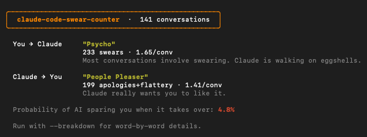

<div align="center">

# claude-code-swear-counter

**Find out how much you swear at Claude Code. And how much it apologizes.**

[](https://npmjs.com/package/claude-code-swear-counter)
[](https://npmjs.com/package/claude-code-swear-counter)
[](LICENSE)
[]()



</div>

## What it does

Scans your local Claude Code conversation logs (`~/.claude/projects/`) and tells you two things:

1. **How much you swear at Claude** — every frustrated word, from "stupid" to... worse
2. **How much Claude sucks up to you** — apologies, "great question!", "you're absolutely right"

Then it gives you both a tier. Yours is probably worse than you think.

## Quick start

```bash
npx claude-code-swear-counter
```

That's it.

## Your tier

| Tier | What it means |
|------|--------------|
| **Suspiciously Polite** | Not a single swear. Are you even using Claude Code? |
| **Oops** | One or two slipped out. We've all been there. |
| **Eminem** | Every conversation has a few f-bombs. It's not anger, it's rhythm. |
| **Karen Mode** | You want to speak to the code's manager. And yes, you're mad. |
| **Psycho** | Most conversations involve swearing. Claude is walking on eggshells. |
| **Gordon Ramsay Mode** | The code is RAW. And Claude knows it. |

## Claude's tier

| Tier | What it means |
|------|--------------|
| **Stone Cold** | Zero apologies. Claude said what it said. |
| **Straight Shooter** | Minimal flattery. Refreshingly blunt. |
| **Smooth Operator** | Claude is being polite. Suspiciously polite. |
| **People Pleaser** | Claude really wants you to like it. |
| **Therapist Mode** | Claude validates your feelings more than your code. |
| **Golden Retriever** | Claude would apologize for apologizing. And then compliment you about it. |

## Options

```
--breakdown    Word-by-word breakdown tables
--me           Just your swearing
--claude       Just Claude's apologies/sycophancy
--json         Machine-readable output
```

### Breakdown

```
╭────────────────────╮
│  You swore         │
├────────────┬───────┤
│  stupid    │    80 │
│  hell      │    35 │
│  f***      │    28 │
│  dumb      │    27 │
│  s***      │    16 │
│  broken    │    16 │
│  useless   │     9 │
│  ...       │   ... │
├────────────┴───────┤
│  TOTAL        233  │
╰────────────────────╯
```

## What counts as swearing

The classics (you know which ones), internet shorthand (`wtf`, `ffs`, `stfu`), and frustration words (`stupid`, `dumb`, `useless`, `broken`, `garbage`, `trash`, `ridiculous`, `nightmare`, `hate`, `ugh`). Because telling Claude its output is "useless garbage" absolutely counts.

## What counts as sycophancy

Claude saying things like "You're absolutely right", "Great question!", "That's a great point" — the verbal equivalent of a participation trophy.

## Requirements

- Node.js 18+
- Claude Code installed (it reads from `~/.claude/projects/`)
- A history of yelling at an AI

## Zero dependencies

No `chalk`. No `ora`. No `inquirer`. Just raw ANSI escape codes and box-drawing characters like nature intended.

## Coming soon: MCP Server

Because apparently everything needs an MCP server now.

Want Claude to know in real-time that you just called it stupid? We're on it. Nobody asked for this. You're welcome.

> _"Do we need an MCP server for swear word counting?"_
> _— No. But we're building one anyway._

## Contributing

PRs welcome. Especially if you want to add more swear words. We know we're missing some.

## License

MIT
